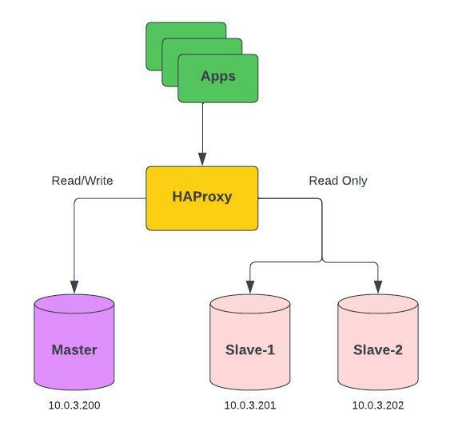

# Postgresql Replication and Load Balancing with Docker

### Tools
- Postgres 13
- HAProxy

### Design



### Manual Installation 
1. Run Postgres ```docker-compose up -d```

2. Create User For Replication
    ```sh
    # 1. Enter the container
    docker exec -it database-master /bin/sh

    # 2. Connect to PostgreSQL
    psql -U postgres

    # 3. Create user replica
    postgres-# CREATE ROLE repuser1 WITH LOGIN REPLICATION CONNECTION LIMIT 5 PASSWORD '123456';
    Username repuser1; Maximum number of links: 5; Password: 123456

    postgres-# CREATE ROLE repuser1 WITH LOGIN REPLICATION CONNECTION LIMIT 5 PASSWORD '123456';
    Username repuser1; Maximum number of links: 5; Password: 123456

    # 4. View rules
    postgres-# \du
                                       List of roles
    Role name |                         Attributes                         | Member of 
    -----------+------------------------------------------------------------+-----------
    postgres  | Superuser, Create role, Create DB, Replication, Bypass RLS | {}
    repuser1  | Replication                                               +| {}
              | 5 connections                                              | 
    repuser2  | Replication                                               +| {}
              | 5 connections                                              |
    ```

3. Modify the master configuration file

    ```pg_hba.conf```
    ```sh
    host    replication     repuser         10.0.3.201/24           md5
    host    replication     repuser2        10.0.3.202/24           md5
    ```

    ```postgresql.conf```
    ```sh
    archive_mode = on				# Enable Archive Mode
    archive_command = '/bin/date'	# Set archiving behavior
    # The sum of the number of concurrent connections from the slave to the host
    max_wal_senders = 10			
    # Specifies that if the backup server needs to obtain log segment files for stream replication, pg_ The minimum size of past log file segments that can be retained in the wal directory	
    wal_keep_size = 16		
    # Specify a list of backup servers that support synchronous replication
    synchronous_standby_names = '*'
    ```

4. Craete basebackup on slave

    ```Slave 1```
    ```sh
    # 1. Enter the container slave 1
    docker exec -it database-slave-1 /bin/sh

    # 2. Back up the host data to the repl folder. Here, enter the password set above: 123456
    pg_basebackup -R -D /var/lib/postgresql/repl -Fp -Xs -v -P -h 10.0.3.200 -p 5432 -U repuser1
    ```

    ```Slave 2```
    ```sh
    # 1. Enter the container slave 2
    docker exec -it database-slave-2 /bin/sh

    # 2. Back up the host data to the repl folder. Here, enter the password set above: 123456
    pg_basebackup -R -D /var/lib/postgresql/repl -Fp -Xs -v -P -h 10.0.3.200 -p 5432 -U repuser2
    ```

5. Reconfig docker volumes slave

    Slave 1
    ```
    volumes:
      - ./data/slave1:/var/lib/postgresql/data
      - ./data/repl1:/var/lib/postgresql/repl
    ```

    ```
    volumes:
      - ./data/repl1:/var/lib/postgresql/data
    ```

    Slave 2
    ```
    volumes:
      - ./data/slave2:/var/lib/postgresql/data
      - ./data/repl2:/var/lib/postgresql/repl
    ```

    ```
    volumes:
      - ./data/repl2:/var/lib/postgresql/data
    ```

    After modif run command ```docker-compose up -d```, if not work restart container slave manual

6. Status database replication
    ```sh
    docker exec -it database-master /bin/sh
    # su postgres
    postgres@63a405212465:/$ psql
    psql (13.8 (Debian 13.8-1.pgdg110+1))
    Type "help" for help.

    postgres=# SELECT * FROM pg_stat_replication;
    pid | usesysid | usename  | application_name | client_addr | client_hostname | client_port |         backend_start         | backend_xmin |   state   | sent_lsn  | write_lsn | flush_lsn | replay_lsn | write_lag | flush_lag | replay_lag | sync_priority | sync_state |          reply_time           
    -----+----------+----------+------------------+-------------+-----------------+-------------+-------------------------------+--------------+-----------+-----------+-----------+-----------+------------+-----------+-----------+------------+---------------+------------+-------------------------------
    36 |    16385 | repuser  | walreceiver      | 10.0.3.201  |                 |       34324 | 2022-08-17 11:41:19.455511+00 |              | streaming | 0/A0000D8 | 0/A0000D8 | 0/A0000D8 | 0/A0000D8  |           |           |            |             1 | sync       | 2022-08-17 11:42:14.418949+00
    37 |    16392 | repuser2 | walreceiver      | 10.0.3.202  |                 |       60442 | 2022-08-17 11:41:24.210798+00 |              | streaming | 0/A0000D8 | 0/A0000D8 | 0/A0000D8 | 0/A0000D8  |           |           |            |             1 | potential  | 2022-08-17 11:42:14.418667+00
    (2 rows)

    postgres=#
    ```

7. Example testing database with Golang

    ```Setup```
    ```sh
    # 1. Install Golang
    https://go.dev/doc/install
    
    # 2. Init module
    go mod tidy
    ```


    ```Try-1 Run apps```
    ```sh
    go run example_apps.go

    Create Data :
    {2 Test}
    IP DB Master: 10.0.3.200

    Read Data :
    {2 Test}
    IP DB Slave : 10.0.3.201
    ```

    ```Try-2 Run apps```
    ```sh
    go run example_apps.go

    Create Data :
    {3 Test}
    IP DB Master: 10.0.3.200

    Read Data :
    {3 Test}
    IP DB Slave : 10.0.3.202
    ```

    Slave database load balancing is working.

### Contact
https://www.linkedin.com/in/aji-indra-jaya

License
----

MIT